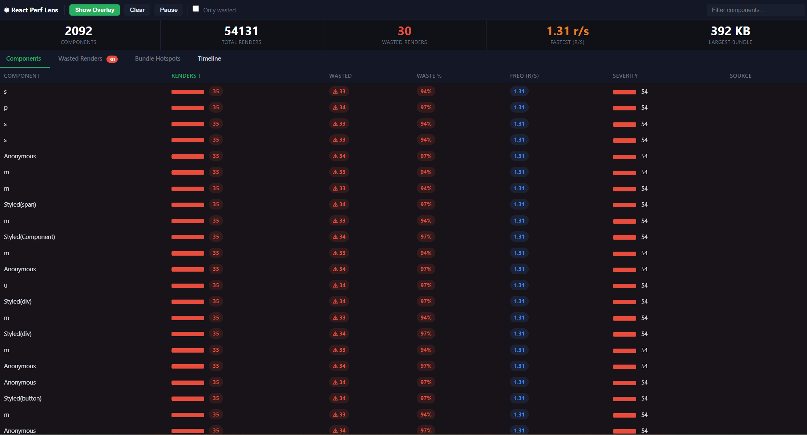
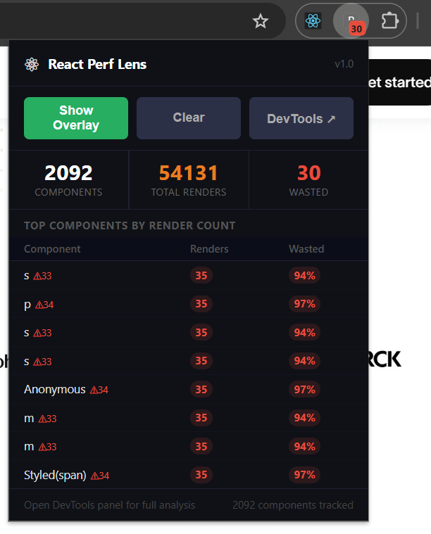

# React Perf Lens

> **Stop guessing. Start seeing.** A zero-config React performance profiler that shows you exactly what's re-rendering, how often, and what it's costing you — right in your browser.

---

## What is React Perf Lens?

**React Perf Lens** is a browser extension + DevTools panel that gives you real-time, component-level visibility into your React app's render behavior. It tracks every component render, identifies wasted work, and surfaces the worst offenders so you can fix them fast.

No code changes. No build config. Just install and profile.

---

## Screenshots

### DevTools Panel — Full Component Breakdown



The full DevTools panel gives you a sortable table of every tracked component. At a glance you see total renders, wasted renders, waste percentage, render frequency, and a severity score — so you can prioritize fixes instead of guessing.

> In the example above: **2,092 components** tracked across **54,131 total renders**, with **30 wasted renders** at a peak rate of **1.31 r/s**. The largest bundle weighed in at **392 KB**.

---

### Extension Popup — Quick Stats at a Glance



The popup gives you a lightweight summary without opening DevTools. It surfaces top components by render count, shows wasted render counts inline, and links directly to the full DevTools panel for deeper analysis.

---

### Overlay Mode — Render Highlighting on the Page


Overlay mode draws render badges directly onto your UI. Each component is tagged with its render count and waste count — so you can see at a glance which parts of the page are hot, without context-switching to DevTools.

---

## Key Metrics Explained

| Metric | What it means |
|---|---|
| **Renders** | Total number of times the component rendered during the session |
| **Wasted** | Renders where output didn't change (props/state identical) |
| **Waste %** | Proportion of renders that produced no visible change |
| **Freq (r/s)** | Peak render rate in renders per second |
| **Severity** | Composite score weighing frequency and waste — higher is worse |

---

## Features

- **Real-time component tracking** — monitors all 2,000+ components in a large app without slowing it down
- **Wasted render detection** — flags renders that produced identical output (prime targets for `React.memo` / `useMemo`)
- **Overlay mode** — visualizes re-render hotspots directly on the page
- **DevTools panel** — sortable, filterable component table with severity scoring
- **Extension popup** — instant summary without leaving your current tab
- **Bundle size reporting** — tracks the largest bundle to keep your app lean
- **Zero config** — works on any React app, no instrumentation required

---

## Who is this for?

React Perf Lens is built for **frontend engineers** who care about runtime performance — whether you're debugging a slow interaction, auditing a production app, or just keeping a new feature lean as you ship it.

It's especially useful when:
- A page feels sluggish but profiling in React DevTools is tedious
- You suspect a high-frequency event (scroll, resize, keypress) is triggering too many re-renders
- You want to validate that your `memo` / `useCallback` optimizations are actually working
- You're onboarding to a large codebase and want to understand its render topology fast

---

## How It Works

React Perf Lens hooks into React's reconciler via the browser extension API. It intercepts render events, computes waste by comparing consecutive render outputs, and streams metrics to both the popup and the DevTools panel in real time. Overlay mode injects a thin layer over the page DOM to draw render badges without affecting layout.

No monkey-patching of React internals. No `__SECRET_INTERNALS_DO_NOT_USE_OR_YOU_WILL_BE_FIRED`.

---

## Installation

> Coming soon to the Chrome Web Store.

For local development:

```bash
git clone https://github.com/your-org/react-perf-lens.git
cd react-perf-lens
npm install
npm run build
```

Then load the `dist/` folder as an unpacked extension in `chrome://extensions`.

---

## Contributing

Issues and PRs welcome. See [CONTRIBUTING.md](./CONTRIBUTING.md) to get started.

---

## License

MIT
